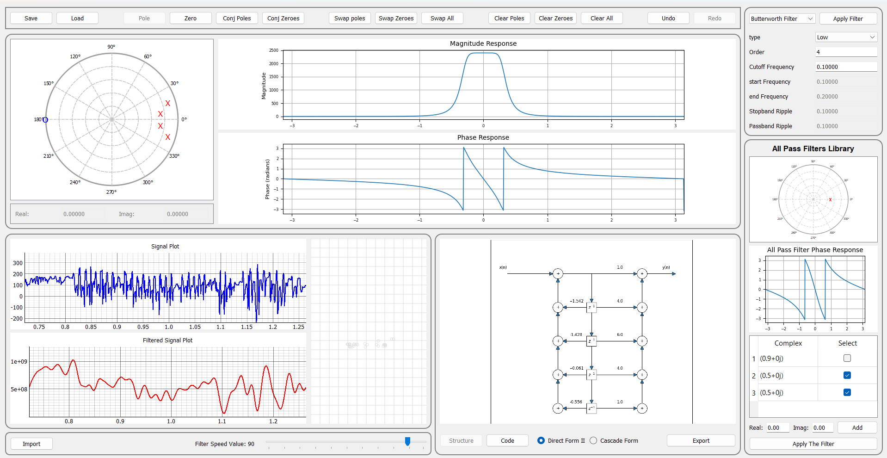

# Digital-Filter-Designer
A desktop app for real-time digital filter design, allowing users to place and manipulate zeros and poles, visualize frequency responses, apply filters to signals, and generate C code. Features include an all-pass filter library, customizable realizations, and interactive signal input.

<div align="center">
  
</div>

## Table of Contents
- [Prerequisites](#prerequisites)
- [Installation](#installation)
- [Features](#features)
- [Contributors](#contributors)

## Prerequisites

- Python 3.6 or higher

## Installation

1. **Clone the repository:**

   ``````
   git clone https://github.com/AhmedAmgadElsharkawy/Digital-Filter-Designer.git
   ``````

2. **Install The Dependincies:**
    ``````
    pip install -r requirements.txt
    ``````

3. **Run The App:**

    ``````
    python main.py
    ``````

## Features

- **Interactive Z-Plane Editor**: Users can place, modify, and delete zeros and poles on the z-plane.  
  - **Add**: Left-click to place the selected type (zero, pole, or their conjugates).
  - **Delete**: Right-click to remove the hovered zero, pole, or conjugate.

- **Graphical Manipulation**: Drag and reposition zeros/poles dynamically on the plot.  

- **Conjugate Mode**: Option to add conjugate pairs for complex zeros/poles.  

- **Zero-Pole Swapping**: Swap all zeros with poles and vice versa.  

- **Undo/Redo Functionality**: Users can revert changes or redo them with simple buttons.  

- **Clear Operations**: Clear all zeros, all poles, or reset the entire design.  

- **Save & Load Filters**: Export and import filter designs using CSV files.  

- **Filter Realization**: Supports Direct Form II and Cascade filter implementations.  

- **C Code Generation**: Automatically generate C code for the designed filter.  

- **Real-Time Filtering**: Apply the designed filter to a signal and visualize the output. 

- **Custom Signal Input**: Users can generate an input signal by moving the mouse in a drawing area.  

- **Adjustable Filtering Speed**: Control the real-time filtering process with a speed slider.  

- **Frequency Response Visualization**: Display magnitude and phase response plots for the designed filter.  

- **Phase Correction with All-Pass Filters**: Compensate for phase shifts by adding all-pass filters.

- **Custom All-Pass Filter Creation**: Users can define their own all-pass filters for phase correction.  

- **Built-in Digital Filter Library**: Includes famous digital filters like Butterworth, Chebyshev, Inverse Chebyshev, Bessel, and Elliptic filters for LPF, HPF, and BPF applications.  


## Contributors
- **AhmedAmgadElsharkawy**: [GitHub Profile](https://github.com/AhmedAmgadElsharkawy)
- **AbdullahMahmoudHanafy**: [GitHub Profile](https://github.com/AbdullahMahmoudHanafy)
- **MohamadAhmedAli**: [GitHub Profile](https://github.com/MohamadAhmedAli)
- **RawanAhmed444**: [GitHub Profile](https://github.com/RawanAhmed444)

